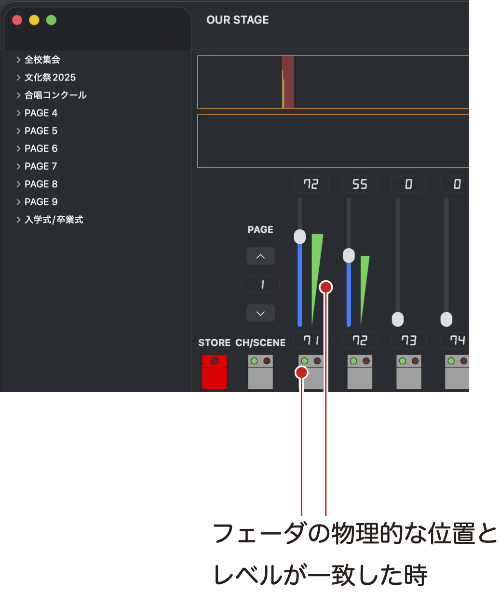
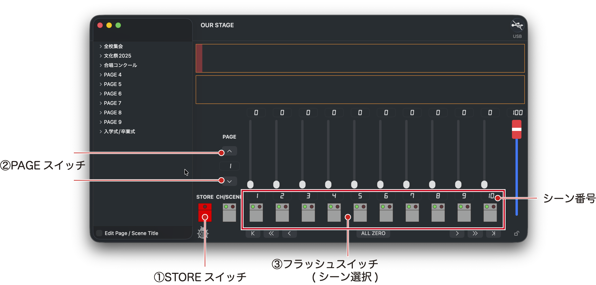
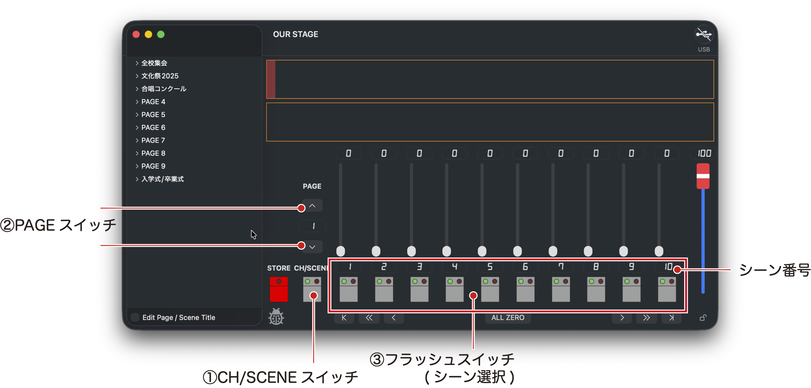
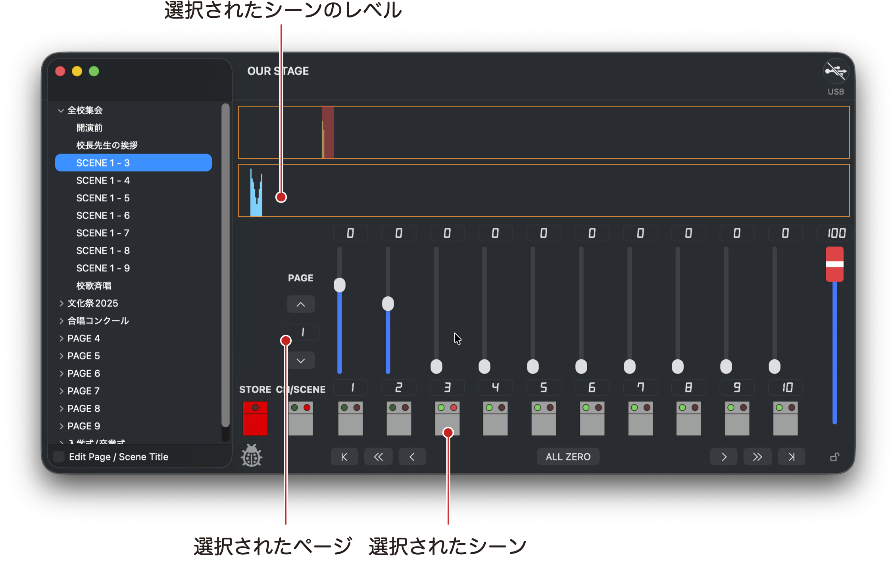

# OUR STATEデモ版の配布
このアプリはAppStoreで入手したアプリと違い、自動で最新バージョンへのアップデートはされません。\
アプリ起動時に最新バージョン公開のメッセージが出たらダウンロードしてください。\
ダウンロードしたアプリは、「アプリケーションフォルダ」に移動(上書きコピー)してください。

アプリのメニューバー「ヘルプ＞OUR STAGE Help」を選択すると、このウェブサイトが開きます。\
最新のアプリ、およひ古いバージョンのアプリは、このページの右側の ***Release*** からもダウンロードできます。\
リリースのページで、「**OUR.STAGE.app.zip**」をクリックするとダウンロードできます。

# 動作環境
- 対応OS：macOS 15以上
- 配布形式：Appleのノータリゼーションを受けたカスタマーダイレクト配布

# CHモード
このモードではフェーダであかりを作ることができます。\
フェーダを操作して出力レベルを決めます。\
CH/SCENEスイッチを押してCHモード(緑)にします

## 編集CHの指定
レベルを操作するDMXアドレスはウィンドウ上部のバー表示領域をクリック、またはドラッグして選びます。\
DMXアドレスは連続した10チャンネルを一度に編集可能で、フェーダ下のフィールドにDMXアドレスが表示されます。

## フェーダのキャッチ
フェーダは物理的な位置を手動で決めるため、フェーダの位置とレベル出力が一致していない時があります。\
その場合、フェーダの位置がレベル出力と一致した時にレベル変更ができるようになり、この状態を**キャッチした**と表現します。

フェーダの物理的な位置とレベルが一致していない場合、フラッシュスイッチの緑LEDが消灯しています。\
また、フェーダ横のレベルメータの色も薄くなっています。

この状態の時はフェーダを右側のレベルメータが示す位置まで動かすことでキャッチし、あかりを変更することができます

## あかりの状態をシーンとして保存する
1. STOREスイッチを押す
2. PAGEスイッチで保存するページを選ぶ
3. 保存したいシーン番号に対応したフラッシュスイッチを押す

STOREスイッチを押した際、シーンが保存されていない場合はフラッシュスイッチの赤いLEDが点滅します。
シーンが保存されていたとしても、そのシーン番号に対応したスイッチを押せば保存可能です。

- ページ：1〜10
- シーン：各ページ1〜10

合計100シーンを保存することができます。

## フラッシュスイッチ
フラッシュスイッチを押すと、対応したレベルが押している間だけ100%出力します。
あかりの確認で使用できます

# シーンの再生
ページ、シーンを指定して合計100シーンを再生することができます。\
シーンの再生は手動でフェーダを0%→100%へ操作します。\
この操作をしている時、直前に再生していたシーンはクロスフェードで0%になります。

## シーン指定とフェーダ操作
1. CH/SCENEスイッチを押してSCENEモード(赤)にする
2. PAGEスイッチで呼び出すシーンのあるページを選ぶ
3. 再生したいシーン番号に対応したフラッシュスイッチを押す

ここで、選択したシーンはフラッシュスイッチの赤いLEDが点滅します。\
シーン選択を間違えた場合は、正しいフラッシュスイッチを再度押します。\
シーンに記憶されているレベルは、水色のバーでウィンドウ上部に表示されます。

フェーダを0%→100%へ操作すると、シーンがクロスフェードで再生されます。\
シーン転換が完了すると、赤いLEDが点滅から点灯に変わります。

もしシーンを選択した際にフェーダが0%に位置にない場合、フラッシュスイッチの緑色のLEDが消灯しています。\
CHモードの時と同じで、フラッシュスイッチの緑色LEDが点灯していない時は、フェーダを操作してもあかりを出したり、シーンを再生することができません。\
シーンを再生するときはフェーダをまず0%に戻すことで、シーンの再生ができます。

続けてシーンを再生する場合は、次に再生したいシーンをフラッシュスイッチで選択します。\
ページを変更することも可能です。

## サイドバーからシーン選択
サイドバーからもシーン選択ができます。\
サイドバーのシーンはタイトルを編集することができます。\
サイドバーのシーンをクリックすると、ウィンドウ右側の操作パネルのページが切り替わり、シーンに対応したフラッシュスイッチの赤いLEDが点滅します。\
フラッシュスイッチでシーンを選択した時と同じように、フェーダを操作することでシーンを再生できます。

## フラッシュスイッチの効果的な使い方
シーンを再生している時、現在のあかりの中に一時的に特定のあかりを追加したい時があります。\
例えば、暗いシーンの中で雷のLEDライトを光らせるなどの用途があります。\
この時は、

1. シーンの再生をして、フェーダを100%まで操作して転換を終わらる
2. CH/SCENEスイッチを押してCHモードにする(あかりは変化しない)
3. 操作したいCHをウィンドウ上部のレベル表示バーをクリックし、フェーダ上にアサインする
4. フラッシュスイッチを操作する

とすることで、シーンに変化を加えることができます。

# サイドバー
デフォルトではシーンのページ番号、シーン番号のリストが表示されます。
また、ページ、シーンにタイトルをつけることができます。

# デモ動画
こちらにデモ動画を掲載しています。\
簡単な操作方法などがお分かりいただけると思います。\
[OUR STAGEデモ動画を見る](https://youtu.be/zNq_4w6kR58)