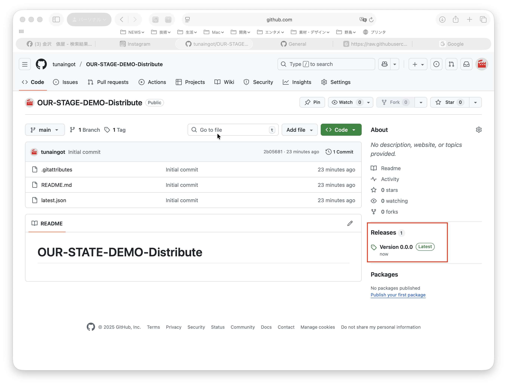
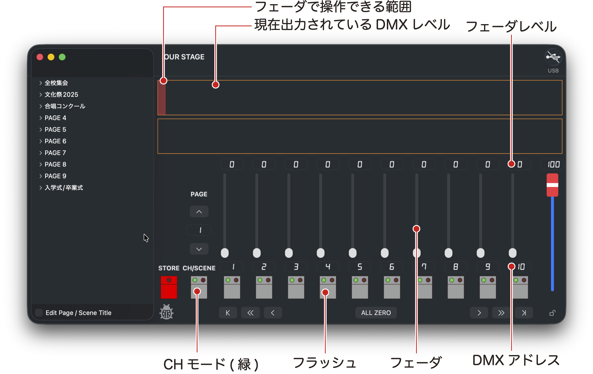
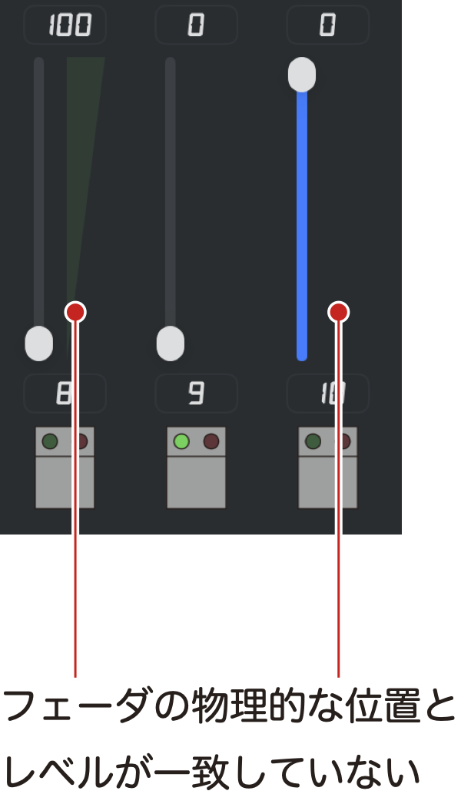

# OUR STATEデモ版の配布
このアプリはAppStoreで入手したアプリと違い、自動で最新バージョンへのアップデートはされません。\
アプリ起動時に最新バージョン公開のメッセージが出たらダウンロードしてください。\
ダウンロードしたアプリは、「アプリケーションフォルダ」に移動(上書きコピー)してください。

アプリのメニューバー「ヘルプ＞OUR STAGE Help」を選択すると、このウェブサイトが開きます。\
最新のアプリ、およひ古いバージョンのアプリは、このページの右側の ***Release*** からもダウンロードできます。\
リリースのページで、「**OUR.STAGE.app.zip**」をクリックするとダウンロードできます。

# 動作環境
- 対応OS：macOS 15以上
- 配布形式：Appleのノータリゼーションを受けたカスタマーダイレクト配布

# CHモード
このモードではフェーダであかりを作ることができます。

フェーダを操作してレベルを決めます。\
レベルを操作するDMXアドレスはウィンドウ上部のバー表示領域をクリック、またはドラッグ&ドロップして選びます。\
DMXアドレスは連続した10チャンネルを一度に編集可能で、フェーダ下のフィールドにDMXアドレスが表示されます。

## フェーダのキャッチ
フェーダは物理的な位置を手動で決めるため、フェーダの位置とレベル出力が一致していない時があります。\
その場合、フェーダの位置がレベル出力と一致した時にレベル変更ができるようになり、この状態を**キャッチした**と表現します。

フェーダの物理的な位置とレベルが一致していない場合、フラッシュスイッチの緑LEDが消灯しています。\
また、フェーダ横のレベルメータの色も薄くなっています。\
この状態の時はフェーダを右側のレベルメータが示す位置まで動かすことでキャッチします。

